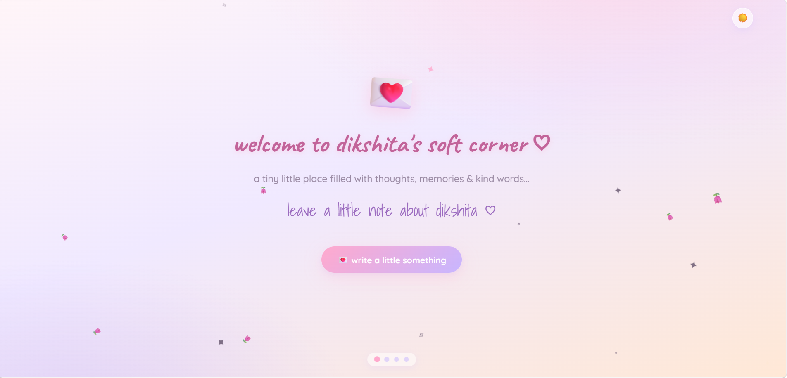
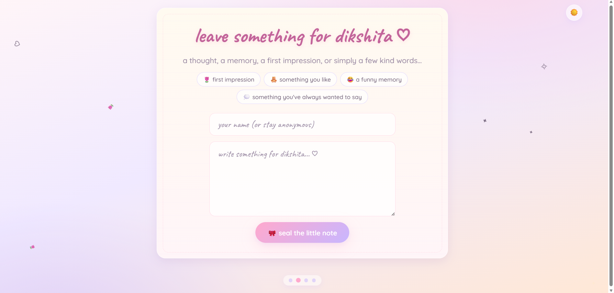
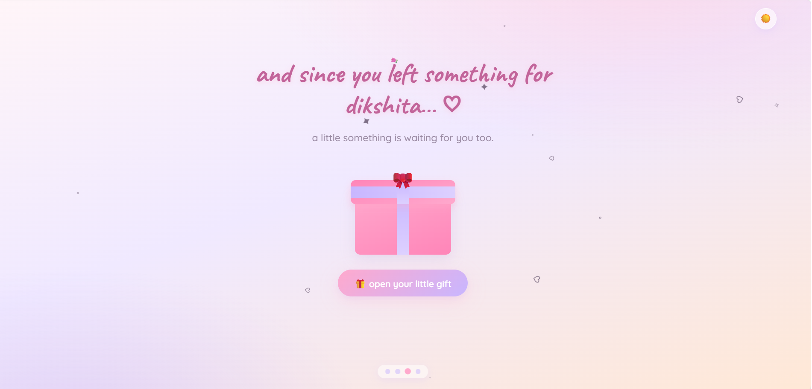
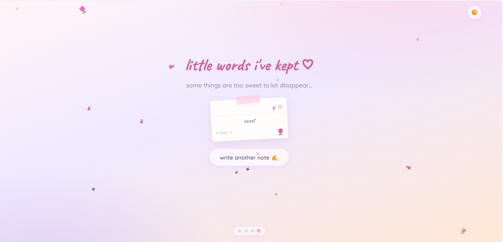
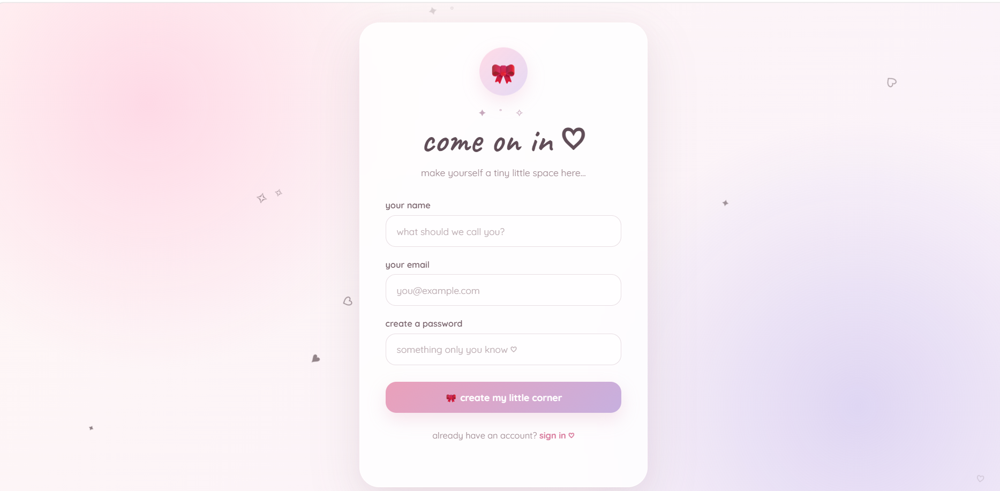

# Little Notes ♡

A soft, interactive personal web experience designed to feel like a
little digital corner for writing notes, memories and cute surprises.

## ✨ Features

- 🌷 Interactive welcome screen
- 💌 Write and save personal notes
- 🎁 Interactive gift section
- 🖼️ Memory Wall
- ✨ Floating particles and animations
- 🌙 Light / Dark theme toggle
- 🎵 Music toggle
- 🔐 Supabase Authentication
- 📱 Responsive design
- 💖 Soft and aesthetic user interface

## 🛠️ Tech Stack

- HTML5
- CSS3
- JavaScript
- Supabase
- Google Fonts

## 🌙 Theme Modes

The website supports both light and dark themes.

### Light Mode



### Dark Mode

> Add your dark-mode screenshot here if you have one.

## 📸 Screenshots

### 🏠 Home


### 💌 Write a Note



### 🎁 Gift



### 🖼️ Memory Wall



### 🔐 Sign Up



## 🔐 Authentication

User authentication is handled using **Supabase Authentication**.

Users can securely sign up and log in before accessing their personal
space.

## 💾 Notes & Memory Wall

Notes are stored using Supabase and displayed on the Memory Wall.

Each authenticated user can create and view their own saved notes.

## 🚀 Getting Started

### 1. Clone the repository

```bash
git clone YOUR_REPOSITORY_URL
